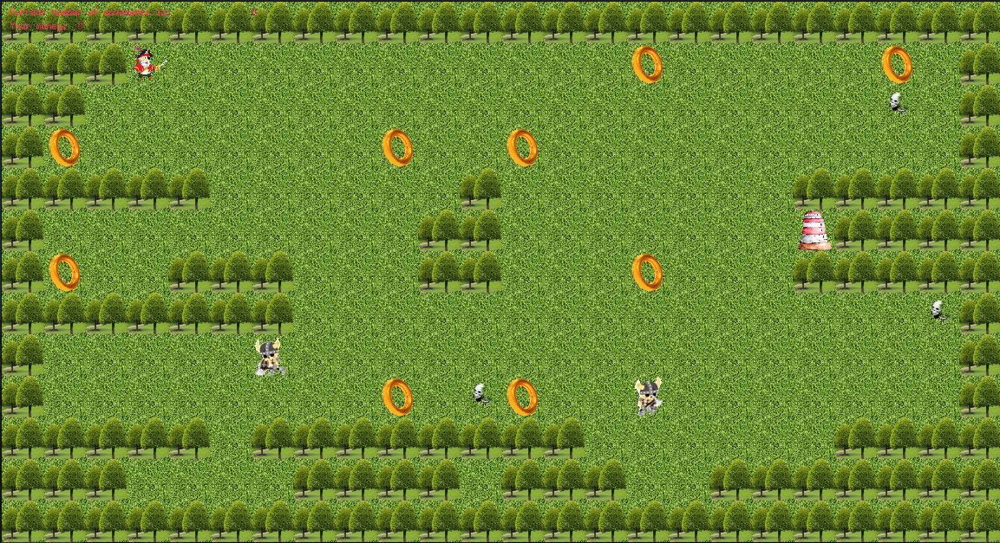

# soLong. RU / EN

[RU](./README.md)
---
`DESCRIPTION`

This project is a small 2D game and base for 2D game. 
It is built to make work with textures, sprites. 
And some very basic gameplay elements.

To start game version run "make bonus".

The header SoLong.h shows the structure of this project.

For each function in the project, a description is made in the 
appropriate files (see SoLong.h).

__ATTENTION: for macOS and Linux.__
---
`GUIDE FOR RUN THE GAME`

To start the game:
1. Download / clone this entire repository to yourself
2. In the terminal go to the project folder "project"
```sh
cd project
```
3. In each part (the engine and the game itself) there 
    is a README.txt with detailed instructions. 
    Short:
    
1. To create the game, use the command:
    
```sh
make bonus
```  
        
    then start the game with the command:
```sh
./so_long ./soLong_bonus/maps/2.ber
```    
<br>

2. To create the base, use the command:
```sh
make
```        
    then start the base with the command:
```sh
./so_long ./soLong/maps/1.ber
```    

Above `./so_long` is the name of the game, 
and `./soLong_bonus/maps/2.ber` is the path to the map.

You can also create maps yourself for more variety.

Maps storage folder:

base        [soLong/project/soLong/maps/](./project/soLong/maps/)

the game    [soLong/project/soLong_bonus/maps/](./project/soLong_bonus/maps/)

Enjoy your game !!!
